# Flujogramas — Siete Academy

> Diagramas en **Mermaid** (renderizables nativamente en GitHub, GitLab, VS Code, Obsidian, Notion).
> Si los abres en un visor que no soporta Mermaid, usa <https://mermaid.live> y pega el bloque.

Índice:

1. [Arquitectura general (C4 nivel 1)](#1-arquitectura-general-c4-nivel-1)
2. [Componentes internos del backend](#2-componentes-internos-del-backend)
3. [Modelo de datos (ER simplificado)](#3-modelo-de-datos-er-simplificado)
4. [Flujo del aspirante: postulación → decisión](#4-flujo-del-aspirante-postulación--decisión)
5. [Flujo del admin: aprobar aplicación → enrolar alumno](#5-flujo-del-admin-aprobar-aplicación--enrolar-alumno)
6. [Flujo del alumno: módulo → progreso → entrega](#6-flujo-del-alumno-módulo--progreso--entrega)
7. [Flujo del profesor: cola de revisiones → review](#7-flujo-del-profesor-cola-de-revisiones--review)
8. [Flujo de emisión y verificación de certificado](#8-flujo-de-emisión-y-verificación-de-certificado)
9. [Pipeline ATS de placement (state machine)](#9-pipeline-ats-de-placement-state-machine)
10. [Ciclo de vida de una aplicación (state diagram)](#10-ciclo-de-vida-de-una-aplicación-state-diagram)
11. [Ciclo de vida de un enrollment](#11-ciclo-de-vida-de-un-enrollment)
12. [Autenticación: dev bypass vs. Firebase](#12-autenticación-dev-bypass-vs-firebase)
13. [Pipeline AI (Claude scoring + drafts)](#13-pipeline-ai-claude-scoring--drafts)
14. [Mapa de navegación por rol](#14-mapa-de-navegación-por-rol)

---

## 1. Arquitectura general (C4 nivel 1)

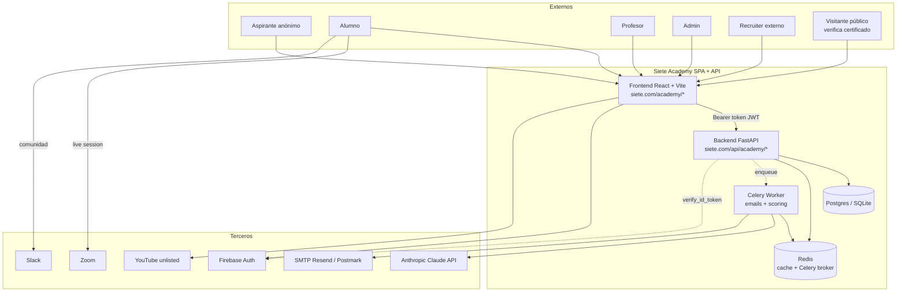

---

## 2. Componentes internos del backend

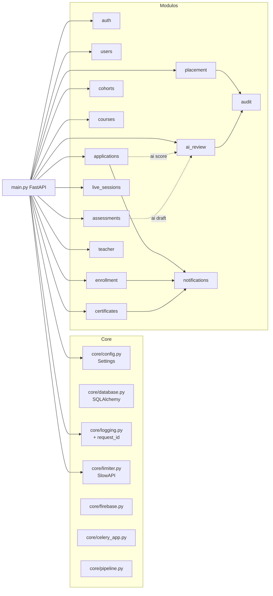

---

## 3. Modelo de datos (ER simplificado)

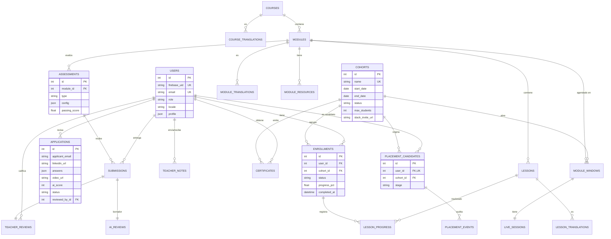

---

## 4. Flujo del aspirante: postulación → decisión

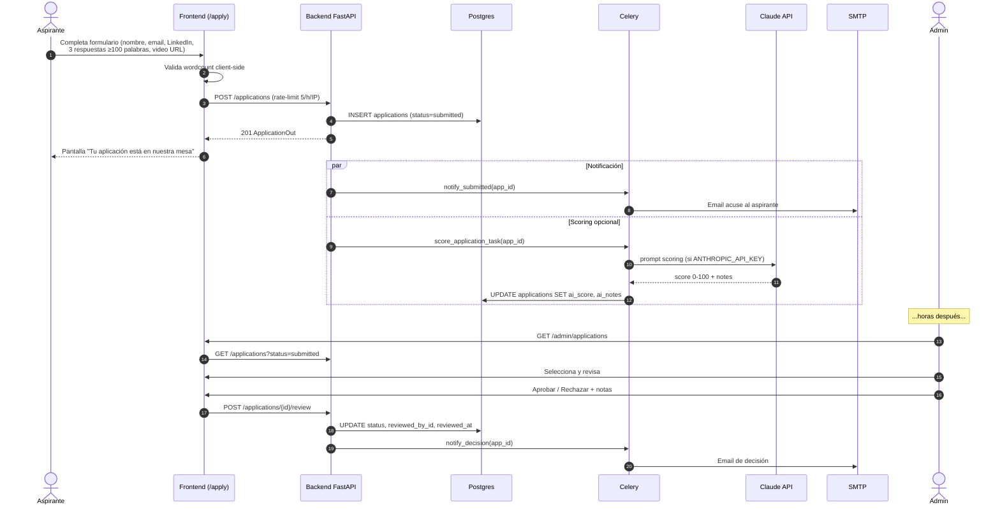

---

## 5. Flujo del admin: aprobar aplicación → enrolar alumno

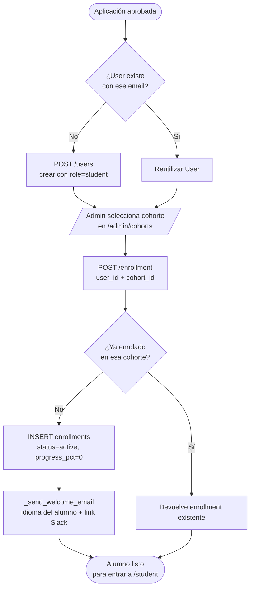

---

## 6. Flujo del alumno: módulo → progreso → entrega

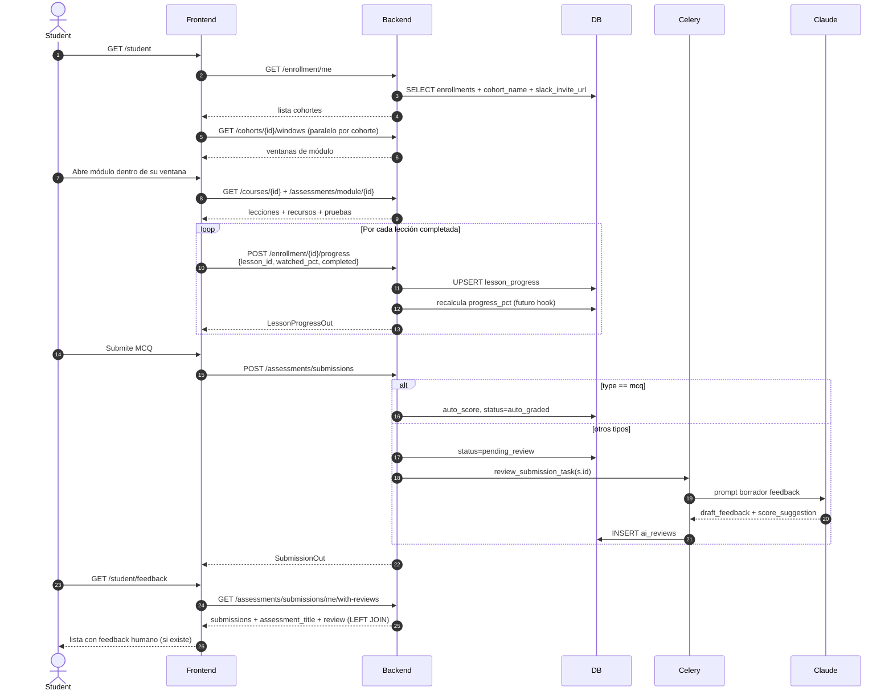

---

## 7. Flujo del profesor: cola de revisiones → review

```mermaid
flowchart LR
  start([Teacher entra a /teacher/reviews]) --> fetch[GET /teacher/pending<br/>shape enriquecido]
  fetch --> filter{¿Filtra por<br/>alumno o entregable?}
  filter -->|Sí| narrow[Lista filtrada]
  filter -->|No| narrow[Lista completa]
  narrow --> select[Selecciona submission]
  select --> ai[GET /ai-review/submission/{id}]
  ai --> hasDraft{¿Existe AIReview?}
  hasDraft -->|Sí| showDraft[Muestra borrador Claude<br/>solo al profesor]
  hasDraft -->|No| empty[Sin borrador]
  showDraft --> grade[Profesor escribe feedback<br/>+ score + adjunto opcional]
  empty --> grade
  grade --> submit[POST /assessments/submissions/{id}/review]
  submit --> persist[INSERT/UPDATE teacher_reviews<br/>+ submission.status=reviewed]
  persist --> studentSees([Alumno ve la review<br/>en /student/feedback])
```

---

## 8. Flujo de emisión y verificación de certificado

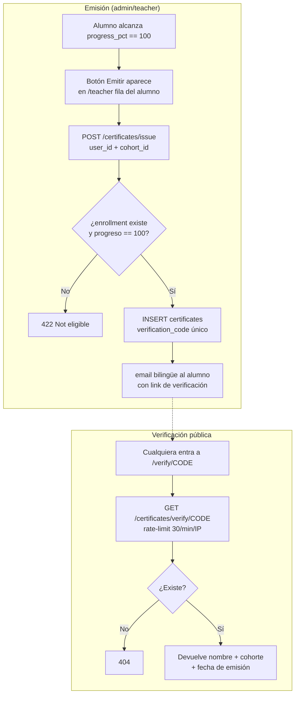

---

## 9. Pipeline ATS de placement (state machine)

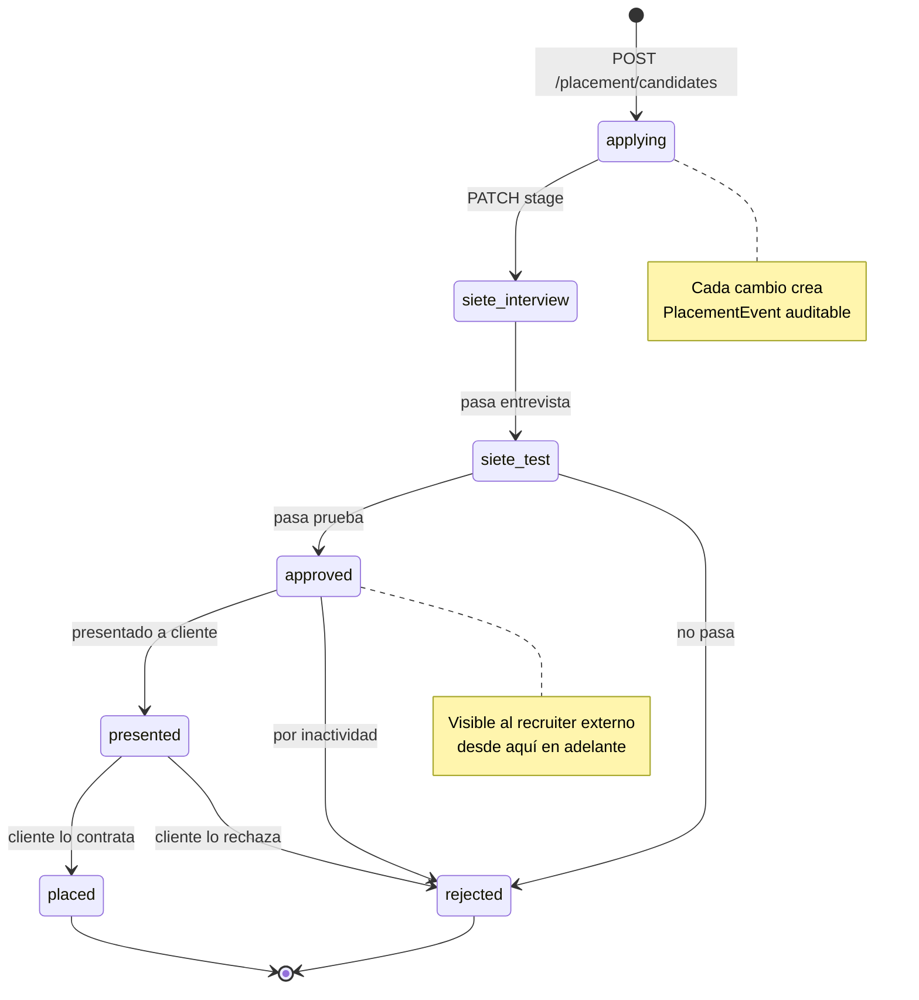

---

## 10. Ciclo de vida de una aplicación (state diagram)

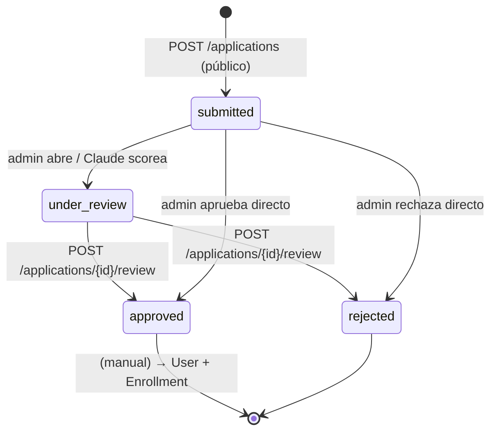

---

## 11. Ciclo de vida de un enrollment

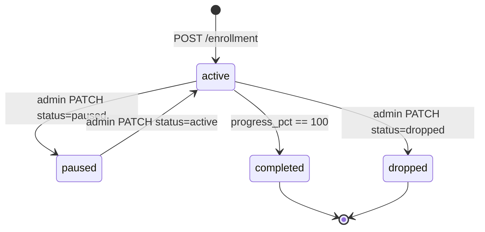

---

## 12. Autenticación: dev bypass vs. Firebase

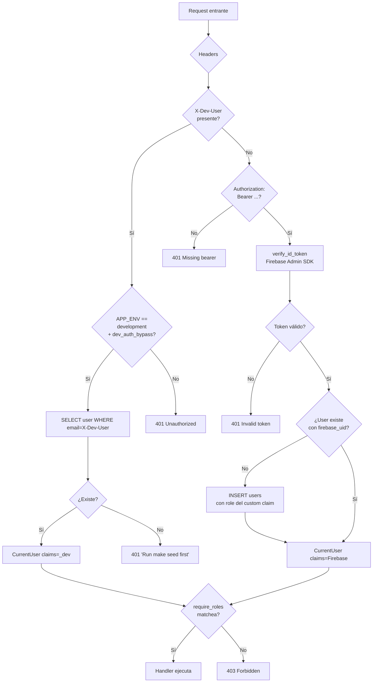

---

## 13. Pipeline AI (Claude scoring + drafts)

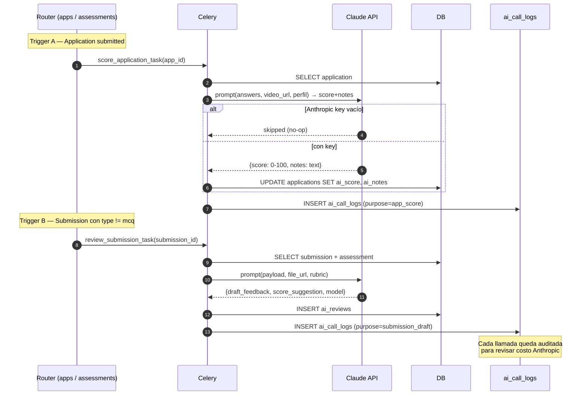

---

## 14. Mapa de navegación por rol

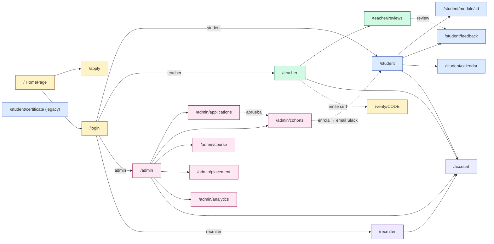

---

## Apéndice — Cómo regenerar/editar estos diagramas

1. Cualquier vista en GitHub renderiza Mermaid de forma nativa.
2. Para editar visualmente: <https://mermaid.live> → pegar el bloque entre los \`\`\`mermaid \`\`\`.
3. VS Code: extensión **Markdown Preview Mermaid Support**.
4. Si agregas un módulo nuevo, recuerda actualizar al menos:
   - Diagrama 2 (componentes)
   - Diagrama 3 (modelo de datos) si introduces tabla nueva
   - Diagrama 14 (navegación) si añade ruta de UI
